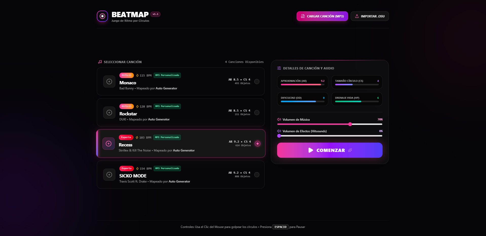
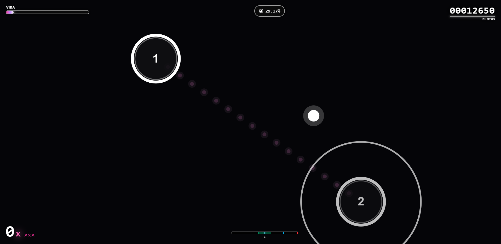
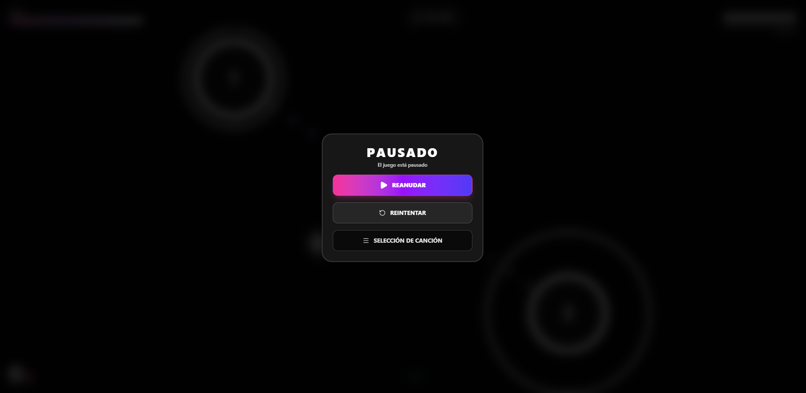
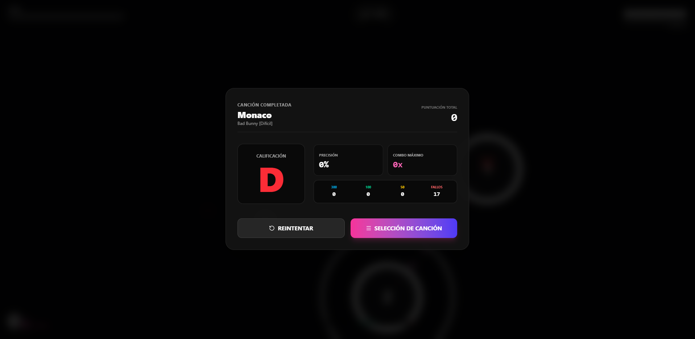

  <h1>🎵 BEATMAP</h1>
  
<b>Juego de Ritmo por Círculos & Generador de Beatmaps por Audio MP3</b>

  

    
    
    
  

---

## 🌟 Sobre BeatMap

**BeatMap** es un juego de ritmo por círculos moderno, dinámico y totalmente responsivo diseñado para ejecutarse directamente en el navegador. Fusiona la precisión táctil de los juegos de ritmo clásicos con una potente suite de análisis de frecuencias de audio que permite generar mapas de ritmo jugables e instantáneos a partir de cualquier archivo MP3 o importar canciones en formato `.osu`.

---

## 🖼️ Galería

  <table>
    <tr>
      <td width="50%"></td>
      <td width="50%"></td>
    </tr>
    <tr>
      <td width="50%"></td>
      <td width="50%"></td>
    </tr>
  </table>

---

## 🔥 Características Principales

* 🎧 **Generación Inteligente de Ritmo desde MP3**: Carga cualquier archivo de audio y el algoritmo detectará automáticamente el BPM, los transitorios de bajos y la intensidad musical para crear un patrón de notas sincronizado.
* 📂 **Soporte para Formato `.osu`**: Importa mapas de la comunidad de *osu!* de forma directa y juega con configuraciones exactas de aproximación (AR), tamaño de círculo (CS) y dificultad (OD).
* ⚡ **Motor Gráfico en Canvas 2D**: Renderizado ultra rápido a 60/120 FPS con rastro de cursor, animaciones de contracción de círculos de aproximación (*Approach Circles*) y retroalimentación de impactos visuales.
* 🎮 **Canciones Precargadas**: Incluye una selección por defecto de temas populares (Bad Bunny, DUKI, Skrillex, Travis Scott) listos para jugar desde el primer instante.
* 📊 **Sistema de Puntuación y Resultados**: Evaluación precisa en tiempo real de combo máximo, precisión porcentual, desglose de notas (300 / 100 / 50 / Fallos) y calificación por grado (S, A, B, C, D) con efectos de celebración.
* ✨ **Estética Neón Cyberpunk**: Interfaz de usuario pulida con efectos de brillo ambiental, desenfoque esmerilado (*Backdrop Blur*), transiciones fluidas con GSAP y personalización de controles.

---

  Desarrollado con ❤️ para amantes de los juegos de ritmo.

